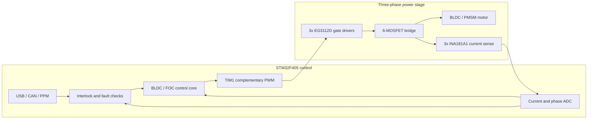

<div align="center">

<a href="hardware/SCH_v2_2026-08-01.pdf"></a>

<sub>คลิกภาพเพื่อเปิด schematic ฉบับเต็ม 5 หน้า</sub>

# ESC-FOC-Drive-V02

**แพลตฟอร์มทดลองไดรฟ์มอเตอร์ BLDC/PMSM สามเฟสบน STM32F405 พร้อม custom VESC firmware และชุด bring-up แบบควบคุมความเสี่ยง**

[](https://www.st.com/en/microcontrollers-microprocessors/stm32f405rg.html)
[](https://github.com/vedderb/bldc)
[](#motor-control-status)
[](#project-at-a-glance)
[](#safety-and-project-status)

[Overview](#overview) · [Architecture](#system-architecture) · [Pin map](#hardware-map) · [Getting started](#getting-started) · [Hardware assets](hardware/README.md) · [Safety](#safety-and-project-status)

</div>

---

## Overview

รีโปนี้รวม firmware, hardware configuration, schematic และชุดทดสอบสำหรับบอร์ด ESC V02 ที่ใช้ `STM32F405RGT6` ควบคุมอินเวอร์เตอร์สามเฟส การพัฒนาปัจจุบันเน้นการ bring-up ที่แรงดันและกระแสต่ำ การตรวจ gate waveform, current sensing และ sensorless BLDC six-step ก่อนขยายไปสู่การทดสอบ FOC บนฮาร์ดแวร์จริง

Custom firmware อิงจาก [VESC firmware](https://github.com/vedderb/bldc) และเพิ่ม target `fw_bldc_lite_24`, pin mapping, software interlock, current protection และคำสั่งตรวจสถานะสำหรับบอร์ดนี้โดยเฉพาะ นอกจากนี้ยังมี Arduino sketches สองชุดสำหรับแยกตรวจ logic และ power stage ก่อนใช้ firmware หลัก

> [!CAUTION]
> นี่คือ engineering prototype ไม่ใช่ ESC สำหรับใช้งานจริงหรือระบบที่เกี่ยวข้องกับความปลอดภัย ภาคกำลังอาจสร้างกระแสสูง ความร้อน แรงดันย้อนกลับ และการหมุนโดยไม่คาดคิด Software trip และปุ่มหยุดไม่สามารถแทน hardware over-current shutdown, fuse, current-limited supply และเครื่องมือวัดแบบ isolated ได้

## Project at a glance

| รายการ | Implementation | ค่าปัจจุบัน / สถานะ |
|:--|:--|:--|
| MCU | STM32F405RGT6, ARM Cortex-M4F | 168 MHz class |
| Motor stage | Three-phase, six MOSFET bridge | U / V / W |
| Gate driver | EG3112D half-bridge drivers | 3 channels |
| Verified firmware target | Custom VESC `fw_bldc_lite_24` | Nominal 24 V |
| Current sensing | INA181A1, gain 20 V/V | 1 mΩ shunt x3 |
| PWM | TIM1 complementary outputs | Approx. 15 kHz switching, 1000 ns initial dead time |
| Bring-up limits | Phase / input / duty | 0.5 A / 0.25 A / 5% |
| Interfaces | USB, CAN, PPM, SWD | VESC Tool and debug access |
| Safety state | Boot-time software interlock | Starts `DISARMED` |

## Motor-control status

| Capability | Status | Notes |
|:--|:--|:--|
| Arduino gate-drive test | Available | Six-step open-loop for logic/scope checks |
| STM32 Arduino bring-up | Available | 30 kHz test PWM, low-power bench use only |
| Custom VESC build | Build verified | Target `fw_bldc_lite_24` |
| Sensorless BLDC six-step | Current bring-up target | Locked as the safe initial motor type |
| FOC | Source base available, hardware validation pending | Do not run motor detection yet |
| Production/high-power use | Not approved | Hardware protection gaps remain |

## Safety controls in firmware

| Control | Current behavior |
|:--|:--|
| Gate startup | HIN/LIN forced LOW during early firmware initialization |
| Arming | Requires `bldc_arm CONFIRM` after every boot |
| Stop input | SW3 or SW4 disarms and requests a fault stop |
| Normal over-current | Trips above 1.5 A for 4 consecutive control samples |
| Emergency current cutoff | Trips immediately above 2.2 A raw magnitude |
| Open-loop command | `foc_openloop_duty` disabled for this target |
| Regeneration | Negative current constrained near zero during bring-up |

These controls reduce software-side risk, but they do not compensate for missing hardware current cutoff, gate-driver fault feedback, MOSFET temperature sensing, or a physical VSUPPLY ADC.

## System architecture



คำสั่งมอเตอร์ผ่าน software interlock ก่อนเข้าสู่ control core ส่วนกระแสทั้งสามเฟสถูกอ่านกลับเข้าระบบ protection และ control loop โดยตรง

## Hardware map

| Function | Net / peripheral | STM32F405 pin |
|:--|:--|:--|
| High-side PWM U / V / W | TIM1 CH1 / CH2 / CH3 | PA8 / PA9 / PA10 |
| Low-side PWM U / V / W | TIM1 complementary outputs | PB13 / PB14 / PB15 |
| Current U / V / W | ADC current feedback | PC0 / PC1 / PC2 |
| Phase voltage U / V / W | ADC phase feedback | PA0 / PA1 / PA2 |
| Stop switches | SW3 / SW4, active LOW | PC4 / PC5 |
| PPM input | Timer input | PB6 |
| CAN | CAN1 RX / TX | PB8 / PB9 |
| USB | USB FS DM / DP | PA11 / PA12 |
| Programming | SWDIO / SWCLK | PA13 / PA14 |

## Hardware design files

<div align="center">

<a href="hardware/README.md"></a>

</div>

| Design asset | Available file |
|:--|:--|
| Electrical schematic | [Five-page schematic PDF](hardware/SCH_v2_2026-08-01.pdf) |
| Bill of materials | [BOM spreadsheet](hardware/BOM_BLDCv02.xlsx) |
| Assembly placement | [Pick-and-Place spreadsheet](hardware/PickAndPlace_BLDCV02.xlsx) |
| PCB manufacturing | [Gerber package](hardware/Gerber_BLDCV02.zip) |
| Hardware guide | [Revision and manufacturing notes](hardware/README.md) |

ตรวจ revision, footprint, polarity, connector pinout, clearance และความสัมพันธ์ระหว่าง schematic, BOM, Pick-and-Place และ Gerber ทุกครั้งก่อนสั่งผลิต

## Getting started

### 1. Clone the repository

```powershell
git clone https://github.com/poommyroboticcamera-netizen/ESC-FOC-Drive-V02.git
cd ESC-FOC-Drive-V02
```

### 2. Read the bring-up documents

เริ่มจากเอกสารเหล่านี้ตามลำดับ:

1. [`vesc_firmware_custom/README_BLDC_LITE_TH.md`](vesc_firmware_custom/README_BLDC_LITE_TH.md)
2. [`vesc_firmware_custom/FLASH_AND_FIRST_TEST_TH.md`](vesc_firmware_custom/FLASH_AND_FIRST_TEST_TH.md)
3. [`vesc_firmware_custom/BUILD_INFO_TH.md`](vesc_firmware_custom/BUILD_INFO_TH.md)
4. [`vesc_firmware_custom/CALIBRATION_2026-09-07_TH.md`](vesc_firmware_custom/CALIBRATION_2026-09-07_TH.md)

### 3. Build the custom VESC target

```sh
cd vesc_firmware_custom
make arm_sdk_install
make fw_bldc_lite_24
```

The recorded verified build used ARM GNU Toolchain 14.2.1 and upstream VESC commit `4c111e2c5dcd2108a2c1029181940aa7f6d04dbd`. Build success does not prove electrical safety on the assembled board.

### 4. Backup and flash

Connect ST-LINK to SWD with the motor disconnected. Probe first, then create a 1 MiB backup before writing firmware:

```powershell
.\tools\flash_bldc_lite_24.ps1 -Probe
.\tools\flash_bldc_lite_24.ps1 -BackupOnly
.\tools\flash_bldc_lite_24.ps1 -Flash24V -MotorDisconnected -PowerLimited
```

The script refuses to flash unless the required safety flags are supplied. Do not use read-unprotect as part of this workflow because it can erase the original device contents.

### 5. First power-up

1. Keep the motor disconnected and use a current-limited supply.
2. Connect VESC Tool over USB and run `bldc_hw_status`.
3. Confirm target `BLDC_LITE_24`, current-sense type `INA181A1`, and state `DISARMED`.
4. Check that the three current ADC channels are close to 2048 with no phase current.
5. Verify HIN/LIN, gate voltage and dead time using suitable probes.
6. Arm only after the electrical checks pass: `bldc_arm CONFIRM`.

Do not start automatic Motor Detection until current polarity, current gain, dead time and gate waveforms have been validated on the actual board.

## Arduino bring-up options

| Test path | Board | Purpose | Documentation |
|:--|:--|:--|:--|
| STM32 onboard test | STM32F405RGT6 | Test mapped PWM, ADC, switches and six-step sequence | [STM32 test guide](arduino_stm32f405_bldc_test/README_TH.md) |
| External logic test | Arduino Uno / Nano | Test EG2132-compatible gate inputs independently | [Arduino gate test guide](arduino_eg2132_bldc_test/README_TH.md) |

Both sketches are open-loop bench tools. Neither is production motor-control firmware.

## Repository structure

```text
.
├── README.md                         Project landing page and safety overview
├── hardware/                         Schematic, BOM, Pick-and-Place and Gerber
├── docs/assets/                      README preview assets
├── arduino_stm32f405_bldc_test/      Onboard MCU bring-up sketch
├── arduino_eg2132_bldc_test/         External Arduino gate-drive sketch
└── vesc_firmware_custom/
    ├── hwconf/custom_bldc/            Board-specific VESC target
    ├── motor/                         BLDC and FOC control changes
    ├── tools/                         Build, backup, flash and test helpers
    ├── tests/                         Host-side control/protection tests
    └── docs/                          Porting and engineering records
```

Generated build outputs, local backups, firmware binaries, test reports and temporary renders are excluded from version control.

## Validation evidence

| Check | Recorded result |
|:--|:--|
| `fw_bldc_lite_24` compile | Passed |
| Firmware text / data / bss | 449,556 / 2,812 / 172,864 bytes |
| Vector table static check | Valid RAM stack pointer and Thumb reset vector |
| Target metadata | `BLDC_LITE_24`, `INA181A1` present |
| Arduino STM32 sketch compile | Passed, 44,008 bytes flash and 5,256 bytes RAM |
| Physical validation | Still required for every assembled revision |

See [`BUILD_INFO_TH.md`](vesc_firmware_custom/BUILD_INFO_TH.md) and the dated flash reports for the exact revision evidence. Historical test evidence must not be treated as approval for a different PCB, BOM or firmware commit.

## Safety and project status

Known hardware limitations include no independent over-current comparator, no gate-driver fault input to the MCU, no MOSFET temperature sensor, no physical VSUPPLY ADC and high-impedance HIN/LIN pins during the earliest reset interval. DC-link capacitance and gate loading also require waveform-based review.

This repository is suitable for controlled engineering evaluation only. It is not released as a production motor controller, automotive component, medical device or safety-rated system.

No repository-wide license has been selected. Public visibility does not automatically grant permission to copy, modify or redistribute project-specific files. The VESC-derived firmware and bundled third-party components remain subject to their respective upstream licenses.

---

<div align="center">

**Designed for observable, staged and repeatable motor-drive bring-up.**

[Custom firmware](vesc_firmware_custom/README_BLDC_LITE_TH.md) · [Hardware workspace](hardware/README.md) · [First flash guide](vesc_firmware_custom/FLASH_AND_FIRST_TEST_TH.md) · [Report an issue](https://github.com/poommyroboticcamera-netizen/ESC-FOC-Drive-V02/issues)

</div>
