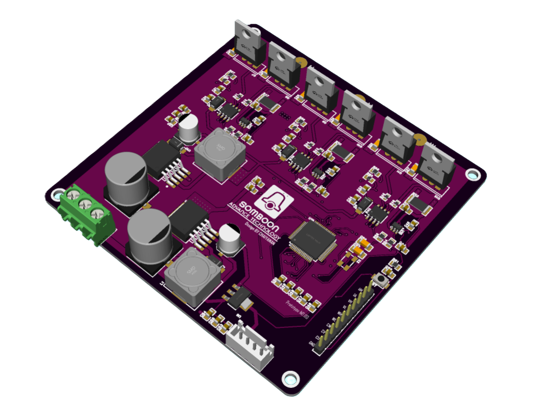
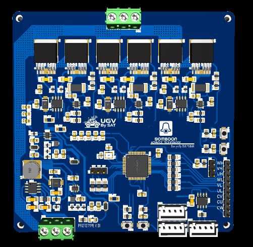
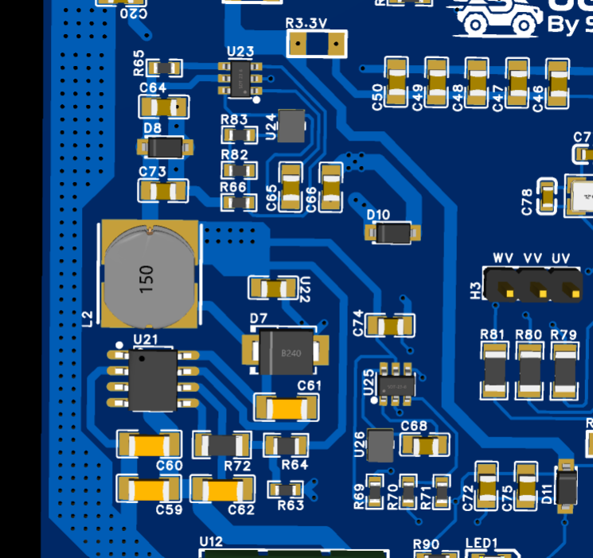
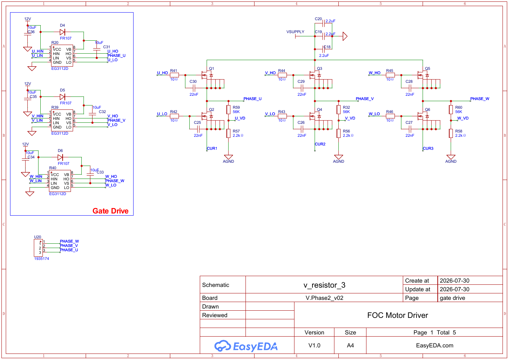

# Hardware design assets

โฟลเดอร์นี้เก็บ design package ของบอร์ด ESC-FOC-Drive-V02 ได้แก่ schematic 5 หน้า, BOM, Pick-and-Place และ Gerber สำหรับการ review และทำ manufacturing handoff

V02 PCB assembly render

> [!WARNING]
> ไฟล์เหล่านี้เป็น engineering design package ไม่ใช่ production release ที่ผ่านการรับรอง ก่อนสั่งผลิตต้องยืนยัน revision, footprint, polarity, clearance, copper current capacity, connector pinout, stack-up และรายการชิ้นส่วนกับบอร์ดจริง

## Available design files

| Asset | Date | Format | File |
|:--|:--|:--|:--|
| Electrical schematic | 2026-08-01 | PDF, 5 pages | [Open schematic](SCH_v2_2026-08-01.pdf) |
| Bill of materials | 2026-07-31 | XLSX | [Open BOM](BOM_BLDCv02.xlsx) |
| Pick-and-Place | 2026-07-31 | XLSX | [Open placement file](PickAndPlace_BLDCV02.xlsx) |
| PCB manufacturing package | 2026-07-31 | Gerber ZIP | [Download Gerber](Gerber_BLDCV02.zip) |

## Board gallery

<table>
<tr>
<td width="48%" align="center"> Complete PCB top view</td>
<td width="52%" align="center"> Power-supply and signal-layout close-up</td>
</tr>
</table>

<strong>Open schematic preview</strong>

## Schematic sections

| Page | Main content | Review focus |
|:--|:--|:--|
| 1 | Gate drivers and three-phase MOSFET bridge | Bootstrap, gate resistance, dead time and DC-link path |
| 2 | STM32F405 MCU and interfaces | PWM mapping, USB, CAN, PPM, SWD and stop switches |
| 3 | Power conversion | VSUPPLY to 12 V, 5 V and 3.3 V rails |
| 4 | Three-channel current sensing | INA181A1 reference, gain and 1 mΩ shunts |
| 5 | Manufacturing/reference captures | Confirm against the actual PCB and current exports |

## Revision guidance

Treat the schematic, BOM, Pick-and-Place, Gerber and firmware pin map as one revision set. If any file changes, record the date, board revision, editor/export version and electrical impact, then regenerate all dependent files.

Before manufacturing:

1. Confirm that Q1-Q6 part numbers, voltage rating, current rating and gate charge match the intended operating point.
2. Verify U13-U15 are INA181A1 and check shunt polarity against firmware current polarity.
3. Check EG3112D input thresholds, bootstrap components and gate-drive supply limits.
4. Review creepage, clearance, copper width, thermal paths, bulk capacitance and fuse/current-limiting strategy.
5. Compare every connector and test point against the assembled-board wiring plan.
6. Inspect Gerber, drill and board outline in an independent viewer before ordering.
7. Run bring-up without a motor first and validate all six gate signals with appropriate probes.

## Manufacturing package status

| Item | Included | Release status |
|:--|:--:|:--|
| Gerber artwork | Yes | Engineering review required |
| Drill data | Expected inside Gerber ZIP | Verify in CAM viewer |
| BOM | Yes | Check availability and substitutions |
| Pick-and-Place | Yes | Confirm origin, rotation and side conventions |
| Assembly drawing | Not listed separately | Generate if required by assembler |
| Production approval | No | Hardware validation pending |

Return to the [project overview](../README.md) for firmware status, pin mapping and safe bring-up instructions.
